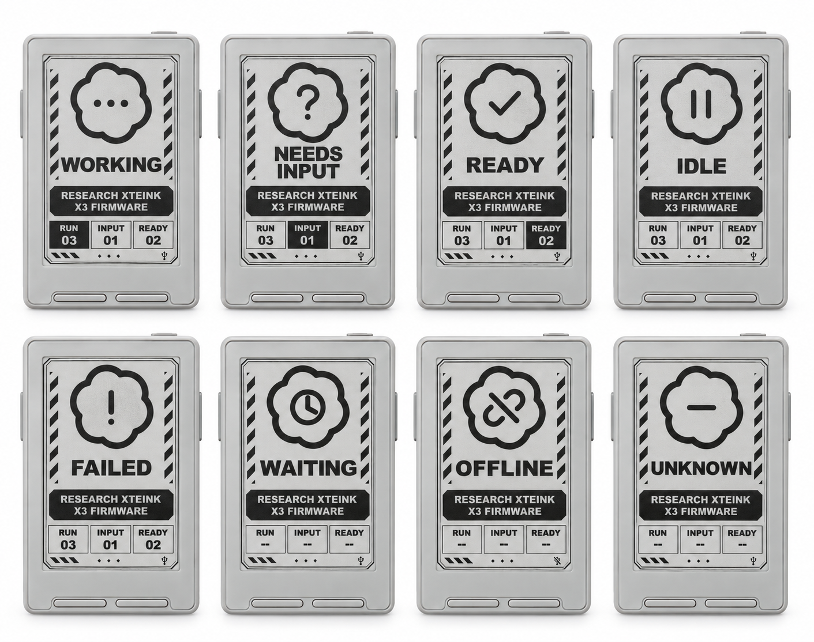

# X3 Codex Companion

A USB-connected **Xteink X3 status display for Codex desktop on Windows**. See which task needs attention without keeping the Codex window in view.



[Watch or download the 22-second promo](https://github.com/midnitefox/x3-codex-companion/blob/main/docs/promo.mp4) · [Direct MP4](https://raw.githubusercontent.com/midnitefox/x3-codex-companion/main/docs/promo.mp4)

*Silent, square-format video. Includes generated device mockups and illustrative customization concepts.*

*Generated device mockup, not a photograph of eight running devices. Screen contrast varies with lighting. [Pixel-accurate interface examples](docs/status-preview.png).*

The screen shows a large status symbol, the selected task's name, and **RUN / INPUT / READY** counts. The matching counter is highlighted. Task selection prioritizes input requests, errors, working tasks, ready responses, then idle tasks. Long names wrap to two lines and end with an ellipsis instead of shrinking. E-ink updates only when the rendered screen changes.

**Experimental, Windows-only integration.** Tested with Codex desktop `26.908.9136`, internal thread-stream version `11`, and one native-USB ESP32-C3 X3. Codex updates can break this internal protocol. This is an independent community project, not an official OpenAI or Xteink integration.

## What you need

- An Xteink X3 compatible with custom firmware and a working USB data connection.
- Windows 11, Codex desktop, Python 3.12, and Node.js 22 or later on PATH.
- The Windows Arial Black font (`ariblk.ttf`), used for large dynamic text.
- A full backup and verified partition layout **before flashing**. See [firmware installation and recovery](docs/FIRMWARE.md).

Do not flash the X4, X4 Pro, or a different ESP32 board with this firmware. The initial device firmware will be replaced. Locked devices are not supported; this project does not bypass firmware locks.

## Quick start

Clone this repository to a permanent folder. The optional startup shortcut points to that location.

```powershell
git clone https://github.com/midnitefox/x3-codex-companion.git
cd x3-codex-companion
.\Setup.ps1
.\.venv\Scripts\python.exe bridge.py --preview-only
```

Open a task in Codex. The preview is saved as `preview.png`; press Ctrl+C to stop. This verifies the PC feed without writing to the X3. If PowerShell blocks local scripts, use an execution-policy exception for the current process only, consistent with your organization's policy; the installer does not change system policy.

Next, follow [firmware installation](docs/FIRMWARE.md). Once the compatible firmware is installed, run:

```powershell
.\Start-Bridge.ps1
```

The bridge checks for an explicit `X3STATUS 1 792 528` handshake before sending an image. It waits if no matching USB device is attached. Exactly one Espressif VID `303A` / PID `1001` device must be present; multiple matching devices are deliberately not guessed.

### Start and stop with Codex

```powershell
.\Enable-Autostart.ps1
```

This adds a per-user Windows Startup shortcut and starts a hidden watcher. It starts the bridge within about five seconds of Codex opening, stops it when the **desktop process exits**, and restarts a bridge that crashes. Minimizing Codex does not stop it. After the feed stops, the X3 enters its offline screen after approximately 15 seconds. No admin privileges or scheduled task are needed.

```powershell
.\Disable-Autostart.ps1
```

This removes only this installation's shortcut and stops its watcher and bridge. `Stop-Bridge.ps1` alone is temporary while the watcher is enabled: the watcher will start it again.

## Status meanings

| Status | Meaning |
| --- | --- |
| Working | A tracked task is active. |
| Needs input | An approval, blocking input request, or accepted unanswered asynchronous question needs attention. |
| Ready | A response is unread and ready to review; this does not certify that the entire project is complete. |
| Idle | The task is not active and has no unread response. |
| Failed | The feed reports a task error. |
| Waiting | Connected but no fresh task status yet, or waiting for the USB bridge at boot. |
| Offline | The PC status feed or device heartbeat has stopped. |
| Unknown | A task's status is absent or unrecognized. |

Counts cover **up to six desktop-followed tasks**, not your whole account. Stale or unknown tracked data produces dashes instead of misleading totals. Discovery depends on the desktop app's follow broadcasts; open the relevant tasks if they do not appear. An optional explicit seed is available:

```powershell
.\.venv\Scripts\python.exe bridge.py --thread YOUR_TASK_ID
```

There is no personal task ID shipped in the default configuration. The display is static: no pet, sound, touch controls, or continuous animation.

## Make your own interface

Use the [copy-and-paste customization prompt](docs/CUSTOMIZE.md#prompt-for-codex-or-another-coding-assistant) with Codex or another coding assistant. That guide explains SVG templates, text constraints, preview generation, and when a firmware rebuild is necessary. The current design intentionally uses bold type for viewing at a desk; verify your own layout on the physical display.

## Privacy and architecture

The PC reads Codex's local named pipe; the device receives only monochrome image pixels. No API key, paid model call, web server, Wi-Fi, or cloud relay is required. See [architecture and privacy](docs/ARCHITECTURE.md) for the local event-log fallback used to detect asynchronous questions.

Runtime previews can contain your task titles. Logs, previews, backups, and local build artifacts are ignored by Git. Do not upload device backups: they may contain settings or credentials.

## Development and checks

```powershell
.\.venv\Scripts\python.exe -m pip install -r requirements-dev.txt
npm ci
.\.venv\Scripts\python.exe -m unittest discover -p "test_*.py"
npm test
.\test-lifecycle.ps1
.\.venv\Scripts\pio.exe run -d firmware
```

The CI workflow runs Windows bridge checks and builds the firmware. CI cannot validate a physical screen or USB behavior. The original device passed frame acknowledgement, reconnect, timeout, live question, and visual layout checks; this is still an early community release, not a broad hardware compatibility claim.

## License and credits

Project code is MIT licensed. Bundled FreeInk code retains its upstream notices. See [NOTICE.md](NOTICE.md) for display-driver credits, Codex Micro inspiration, font information, and the default unofficial Codex-outline artwork. Trademark rights are not granted by the code license.
